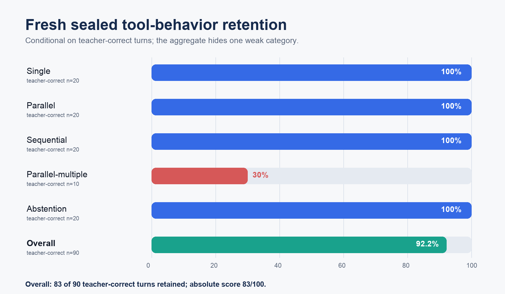

# BTL-3 compression article: implementation appendix

This appendix continues
[How We Compressed BTL-3 to 8.39 GB Without Letting Perplexity Lie](ARTICLE.md).

## 13. Solve the byte ledger before paying for the candidate

The package builder has a dry-run projection. It refuses to begin the expensive
pack unless the projected candidate, required reserve, and selected demotions
fit under the declared limit.

The final logical equation is:

\[
\begin{aligned}
B ={}& B_{\text{decoder}}
- B_{\text{demotion savings}}
+ B_{\text{embedding}} \\
&+ B_{\text{head}}
+ B_{\text{head residual}}
+ B_{\text{behavior adapter}}
+ B_{\text{small state}}.
\end{aligned}
\]

The frozen research package projected 8,551,634,944 logical weight bytes and
reserved 25,000,000 bytes before packing. The portable export later removed
two superseded BF16 provenance files, yielding 8,381,262,032 tensor bytes and
an exact 8,392,369,600-byte GGUF after metadata and alignment.

This detail sounds administrative, but it prevented a recurring failure mode:
building a high-quality decoder and discovering later that embeddings,
metadata, or a correction adapter invalidated the advertised size.

## 14. Materialize a native artifact, not a demo inside BF16

Early gates loaded the full merged teacher and replaced its decoder layers with
packed reconstructions. That was valid for capability experiments but did not
prove deployability.

The standalone materializer changed the proof:

1. instantiate the Qwen text architecture on a meta device;
2. load compact non-matrix state;
3. install packed AVQ2 and INT4 decoder modules;
4. install the 12 retained BF16 islands and two INT4 demotions;
5. load the packed embedding;
6. load the packed output head and rank-32 correction;
7. attach the behavior adapter;
8. verify every manifest checksum; and
9. assert that no compatible dense decoder matrix survives.

The release backend adds native packed CUDA and Metal operators to llama.cpp,
an OpenAI-compatible server, and launch bridges. The exporter byte-verifies
all 2,416 payloads, and the runner generates without the source model. That
closes the difference between “a compressed decoder experiment” and “a
complete compressed model.”

## 15. The release gate and what it means

The fresh gate contains 100 scored turns, 20 from each category:

- single;
- parallel;
- sequential;
- parallel-multiple; and
- abstention.

The tool namespace was newly authored after the candidate froze. Mechanical QA
checked IDs, schemas, parsing, and overlap. The teacher scored 90/100; its ten
misses were all parallel-multiple. The compact artifact scored 83/100.

Conditional retention is

\[
R = \frac{\#\{\text{student correct and teacher correct}\}}
         {\#\{\text{teacher correct}\}}.
\]

The result was:

| Category | Teacher correct | Retained | Conditional retention |
|---|---:|---:|---:|
| Single | 20 | 20 | 100% |
| Parallel | 20 | 20 | 100% |
| Sequential | 20 | 20 | 100% |
| Parallel-multiple | 10 | 3 | 30% |
| Abstention | 20 | 20 | 100% |
| **Overall** | **90** | **83** | **92.2%** |

All outputs stopped. Malformed rate was 7%, entirely inside
parallel-multiple. Inspection showed genuine over-abstention rather than parser
false negatives.

The package passes the overall 90% rule and fails the per-category 90% rule.
Both statements belong in the release.

## 16. What is genuinely ours

The strongest defensible contribution is a novel compression cookbook for
behavior-sensitive models, not a claim that BTL invented every lattice,
curvature, mixed-precision, or low-rank primitive it uses.

### 16.1 Behavior before perplexity

We used exact packed-artifact behavior to overrule token metrics multiple
times. This changed which methods survived and which tensors received bytes.

### 16.2 Causal prefix localization

We treated compression failures like software regressions: bisect the prefix,
override modules at the first cliff, replay the same behavior, and retain only
repairs that work.

### 16.3 Agent-balanced calibration and repair

Calibration and correction explicitly model single, sequential, parallel,
parallel-multiple, and abstention behavior. The data contract is part of the
compression method because the target is an agent, not generic prose.

### 16.4 Exact byte-constrained synthesis

The final representation is the result of measured exchanges:

- vector versus scalar;
- AVQ2 versus INT4;
- protected BF16 islands versus demotions;
- embedding row rescue versus a uniform matrix;
- head AVQ2 versus a rank-32 correction; and
- decoder changes versus a 32.46 MB behavioral adapter.

### 16.5 Standalone, checksummed proof

Every component is physically packed, counted, and loaded without BF16. The
artifact--not a spreadsheet--is the size claim.

Together these decisions form a novel research-engineering method. The
narrower claim of a new universal base quantizer would still require
equal-budget public ablations against faithful UniSVQ, QTIP/YAQA, AQLM/PV,
VPTQ, and conventional mixed-precision baselines across more architectures.

## 17. What we would do differently

1. **Design the behavior gate before the first quantizer.** We spent too long
   trusting token proxies.
2. **Use balanced tool structures from the start.** The early corpus had almost
   no clean parallel examples and too much no-call data.
3. **Budget the vocabulary on day one.** Decoder-only sizes are not product
   sizes.
4. **Separate the development and release gates earlier.** Once a gate guides
   a repair, it is no longer untouched.
5. **Build the native runtime earlier.** Replacing layers inside BF16 is a
   capability test, not a deployment proof.
6. **Stop pure one-bit work sooner.** A rigid 3.9 GB target forced the project
   into the representation regime most hostile to tool behavior.
7. **Report category denominators.** An aggregate can hide a completely dead
   action family or reward a model that always abstains.

## 18. Reproduction checklist

An independent implementation should:

1. pin the exact base revision and post-training adapter;
2. freeze calibration, repair, development, and release splits;
3. create balanced agent/tool calibration;
4. collect FP64 second moments from sequential compressed hidden states;
5. fit four-weight affine-lattice codes for compatible matrices;
6. use group-128 INT4 for the declared full-attention path;
7. write each layer atomically with checksums;
8. gate prefixes and localize the first behavioral cliff;
9. add only behavior-proven precision islands;
10. complete all 64 layers;
11. freeze the packed decoder;
12. train a bounded behavior adapter against that exact decoder;
13. quantize the embedding with a declared rescued-row budget;
14. quantize the head and fit an activation-weighted low-rank residual;
15. solve the byte ledger, including adapters and metadata;
16. materialize a standalone native package;
17. assert that no dense compatible decoder fallback remains;
18. run kernel parity checks;
19. author a new sealed release gate; and
20. report absolute accuracy, teacher score, conditional retention, malformed
    rate, stopping, and every category separately.

## 19. The honest launch sentence

The result we can defend is:

> BTL-3 Compact is a complete 8.39 GB text-only native GGUF for a 27B-class
> agentic model. On a fresh 100-turn private tool-contract gate, it retained
> 83 of 90 teacher-correct turns (92.2% conditional retention), with perfect
> measured retention on single, parallel, sequential, and abstention cases,
> but only 30% on parallel-multiple. Its custom packed backend executes on
> CUDA and Metal without loading the BF16 source checkpoint.

It is less exciting than saying “90% of intelligence in eight gigabytes.” It is
also true, inspectable, and useful. That standard of proof is the most important
part of the recipe.
