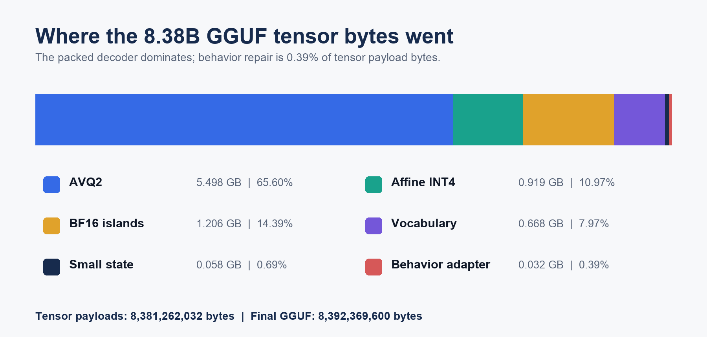
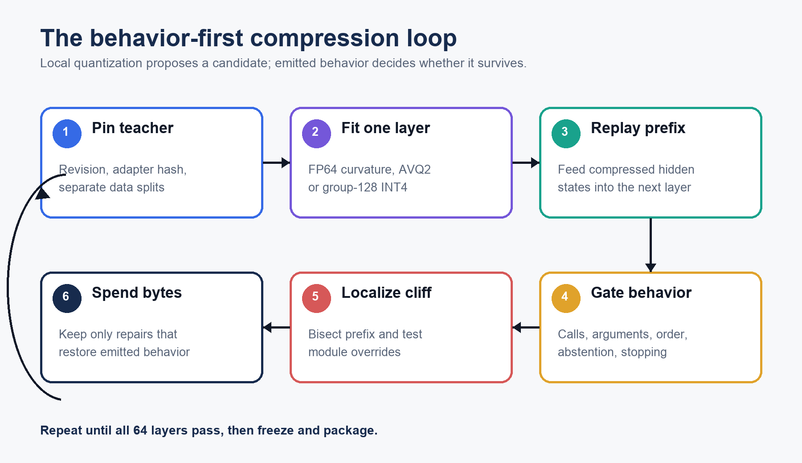

# How We Compressed BTL-3 to 8.39 GB Without Letting Perplexity Lie

## A failure-driven engineering account of low-bit agent compression

BTL-3 is a 27B-class text model specialized for coding, tool use, abstention,
and multi-step agent behavior. Its full-precision lineage is useful precisely
where extreme compression tends to fail: exact structured output, repeated
tool calls, stateful sequences, and the decision not to act.

The compact release is a complete 8,392,369,600-byte native GGUF with packed
CUDA and Metal execution. It loads without the original BF16 checkpoint. On a fresh private tool-contract
gate, it retained 83 of the 90 turns its full-precision teacher solved, or
92.2% conditional tool-behavior retention.

That sentence is deliberately narrow. We are not calling the result “92.2%
intelligence.” We have not yet measured compact-model coding retention on the
public coding suite. The package also retains only 30% of teacher-correct
parallel-multiple cases. The interesting result is not that compression became
free. It is that we found a reproducible path from several convincing-looking
failures to a physically standalone model that preserved most measured agent
behavior.

This article presents that path as a novel compression cookbook: an ordered,
falsifiable procedure for finding behavioral cliffs, exchanging precision
under an exact byte ceiling, repairing the remaining behavior, and proving the
native artifact. It also draws a hard line between public ingredients and the
cookbook that is specific to BTL.

---

## 1. What was actually achieved

The final text-only GGUF contains:

| Component | Physical bytes | Share of tensor payload |
|---|---:|---:|
| AVQ2 tensors | 5,498,130,320 | 65.60% |
| Affine INT4 tensors and final demotions | 919,347,200 | 10.97% |
| Retained BF16 islands | 1,205,862,400 | 14.39% |
| Packed vocabulary and head | 667,713,856 | 7.97% |
| Compact text state | 57,767,936 | 0.69% |
| Behavior adapter | 32,440,320 | 0.39% |
| **Tensor payload total** | **8,381,262,032** | **100%** |

GGUF metadata and alignment add 11,107,568 bytes, bringing the exact file to
8,392,369,600 bytes. The exporter checked 158 source files and byte-verified
all 2,416 tensor payloads. The frozen research package is larger—8,572,070,080
bytes—because it preserves two superseded BF16 island files for provenance;
they are not emitted into the portable artifact.

Artifact validation observed:

- no surviving dense fallback for compatible decoder matrices;
- exact AVQ2 CUDA-kernel parity with the unpacked reference;
- maximum INT4 kernel error of `3.0517578125e-05`;
- successful autoregressive generation from the exact final GGUF;
- 2,416 byte-verified payloads with no unsupported representation;
- 84.70 prompt tokens/s and 43.16 generated tokens/s on an RTX PRO 6000
  Blackwell with full GPU offload; and
- 2.30 prompt tokens/s and 2.48 generated tokens/s on an Apple M2 16 GB.

These two system measurements prove native execution; they are not universal
performance claims. Broader consumer-device profiling remains future work.

---

## 2. Why this was harder than “quantize the weights”

For an ordinary chat model, a compression candidate can look healthy when it
continues to produce plausible prose. For an agent model, a single token can
change the program:

- a tool name must be exact;
- a delimiter must open and close correctly;
- an argument key must match the schema;
- multiple calls must not collapse into one;
- a dependent call must occur after its prerequisite result;
- an irrelevant request must not trigger a side effect; and
- generation must stop at the correct boundary.

Mean-squared weight error averages over all of those decisions. Perplexity
averages over even more tokens that do not control the action. Top-1 token
agreement can be dominated by prompt echoes, natural-language glue, and easy
tokens. A model can therefore score well on a token proxy while being unable to
emit one valid tool call.

That is not a hypothetical concern. We observed it directly:

- a recovered 4B ternary proxy reached roughly 94% teacher-forced token
  agreement in one experiment while retaining only 33.7% of sealed BFCL
  behavior;
- a magnitude-initialized 4B proxy reached 34% assistant-token agreement yet
  produced no valid actionable tool calls in the behavioral gate; and
- a 7 GB scalar GGUF candidate produced fluent text but retained only 42.9% on
  the private teacher-correct tool gate.

The core engineering principle became:

> Compression is promoted by emitted behavior from the exact packed artifact,
> not by a local error metric measured before packaging.

---

## 3. The public building blocks

The final system uses ideas with clear prior art.

[GPTQ](https://arxiv.org/abs/2210.17323) and
[SparseGPT](https://arxiv.org/abs/2301.00774) established efficient
second-order, one-shot transformations for large language models.
[QTIP](https://arxiv.org/abs/2406.11235), AQLM, VPTQ, and related work showed
why vector representations are valuable at extreme bit-widths.
[UniSVQ](https://arxiv.org/abs/2606.10520) parameterizes vector codewords as
affine transforms of an integer lattice and combines scalar-kernel
compatibility with vector flexibility. [LQ-LoRA](https://arxiv.org/abs/2311.12023)
and related work motivate a fixed quantized component plus a compact
high-precision low-rank correction. Mixed-precision quantization and protected
outlier channels are also established method families.

We do not claim those primitives.

We do claim the resulting cookbook as novel. Its contribution is the ordered
system assembled around those primitives: the gates that killed attractive
failures, the calibration mixture, hybrid-decoder prefix localization,
measured precision islands, byte-neutral trades, vocabulary treatment,
behavior repair, and standalone packaging. Prior work supplies ingredients;
the BTL method specifies how evidence selects, combines, rejects, and
physically budgets them for an agentic model.

---

## 4. Freeze the teacher before touching compression

The compression target was not generic Qwen. It was one immutable BTL-3
checkpoint:

- base revision:
  `6a9e13bd6fc8f0983b9b99948120bc37f49c13e9`;
- source adapter SHA-256:
  `37a8f519039707eba5906591cdb14268768db43f80489a9c2f83b3e51e5e89db`;
- public name: BTL-3; and
- release scope: text, coding, tools, and agents.

Freezing matters because a compression result is meaningless if the teacher
moves between calibration, repair, and evaluation. Every packed manifest
records the model revision and adapter checksum. The runtime refuses mismatched
source artifacts.

We also separated three types of data:

1. **Calibration data** for activations and curvature.
2. **Behavior-repair data** for the compact adapter.
3. **Evaluation gates**, which never entered quantizer fitting or repair.

The final release gate was authored only after representation choices were
frozen.

---

## 5. The failure ladder

### 5.1 A mechanically correct scalar ternary model

The first complete 0.8B proxy proved the bit mechanics:

- 1.717654 effective bits per weight;
- exact pack/unpack behavior; and
- all decoder MLPs replaced.

It failed as a model:

- perplexity increased by 9.75 times;
- KL divergence reached 2.2196;
- top-1 token agreement was 43.75%;
- tool tasks were 0/7; and
- code tasks were 0/6.

This result was useful because it separated representation correctness from
capability preservation. A file can contain the advertised number of bits and
still contain a dead model.

### 5.2 W4 established a local precision floor

An exact W4 control used a four-plane decomposition at 4.25 effective bits per
weight. It preserved 7/7 proxy tool cases, with 0.1003 KL and 87.5% top-1
agreement, although its tiny code gate remained 0/2.

The W4 result showed that our implementation and evaluation path could preserve
behavior at a conventional precision. The problem was specifically the
extreme-low-bit representation, not a universally broken harness.

### 5.3 SparseGPT initialization helped, but recovery proxies lied

At 4B, block-Hessian SparseGPT initialization was dramatically better than
magnitude initialization. Before recovery, it raised meaningful token behavior
from nearly zero. After 300 recovery steps, assistant-token agreement reached
65.5%, compared with 34.0% for magnitude initialization.

The behavioral gate was less flattering:

- full-precision teacher: 80% simple, 76% multiple, 80% parallel, 68%
  parallel-multiple, and 80% irrelevance;
- SparseGPT-recovered ternary: 28% simple, 16% multiple, 0% parallel, 4%
  parallel-multiple, and 52% irrelevance;
- magnitude-recovered ternary: 0% on every actionable category.

SparseGPT was clearly the right initializer for that representation, but the
candidate was not remotely releasable.

### 5.4 Longer scalar recovery did not solve the behavior

A balanced 2,000-row recovery set and staged training improved some private
development numbers. The sealed BFCL behavior remained around 33.7%.
Additional optimization increasingly taught the model to abstain, which made
aggregate scores look less bad while actionable calls stayed broken.

This is where we stopped treating pure binary or scalar ternary as an
ideological requirement.

### 5.5 The practical 7 GB GGUF fallback also failed

We produced a real low-bit GGUF candidate and evaluated the exact served
artifact. It retained 27 of 63 teacher-correct private cases, or 42.9%.
Abstention was perfect, but actionable behavior was mostly gone.

The lesson was not that GGUF is bad. The lesson was that this particular scalar
allocation did not preserve BTL-3's agent behavior.

---

## 6. Move from scalar levels to four-weight vector codes

The representation that finally crossed the behavior gate groups four weights
and represents each group using a code from an affine integer lattice.

Let a four-weight vector be \(w \in \mathbb{R}^4\). Its reconstructed value is

\[
\hat{w} = A z_k + b,
\]

where \(z_k\) is a small integer-lattice code, \(A\) is a learned or fitted
affine matrix, and \(b\) is a bias. The code index consumes two bits per weight
when amortized over the four-weight group; affine metadata adds only a small
overhead.

For a matrix \(W\) with activation second moment \(H\), the local objective is

\[
\mathcal{L}_{H}(W,\hat{W}) =
\operatorname{tr}\left((W-\hat{W})H(W-\hat{W})^\top\right).
\]

The implementation uses:

- FP64 activation statistics;
- a randomized 128-wide block Hadamard transform;
- four-dimensional affine integer-lattice codes;
- regularized block-LDL factorization;
- backward code assignment with error propagation;
- coordinate refinement;
- a bounded scale search; and
- optional fixed-code joint reconstruction.

The important storage property is that a compatible matrix lands extremely
close to 2.0 effective bits per weight. Across the final decoder, 336 matrices
use the vector representation and 64 full-attention matrices use group-128
affine INT4.

---

## 7. Calibrate for the behavior you want to keep

The first calibration build accidentally sorted by category. That meant early
activation windows overrepresented one behavior family and later windows
another. We discarded it.

The replacement calibration was balanced and shuffled:

- code and general text;
- agent and tool interactions;
- single calls;
- sequential calls;
- parallel calls;
- parallel-multiple calls; and
- abstention.

The clean UniSVQ experiment used 256 calibration rows and 128 validation rows,
with 294,544 calibration tokens and 178,952 validation tokens. The later
release pack used a bounded source contract for each layer:

- 20 calibration rows;
- sequence length 256;
- one Hessian sweep;
- 1,024 codebook rows;
- two fit iterations;
- 16,384 sampled fit values; and
- seed 20260717.

Those smaller release settings were not chosen because more calibration is
useless. They were a budgeted, restart-safe operating point that had already
passed the behavior ladder.

---

## 8. Quantize sequentially and replay the real hidden states

Every decoder layer changes the distribution received by the next layer. If all
layers are calibrated only against hidden states from the full-precision
teacher, later layers learn to repair inputs they will never see at runtime.

Our pipeline therefore proceeds in model order:

1. capture the input activation to the current layer;
2. collect full second moments;
3. fit the packed matrices;
4. install the packed layer;
5. replay the calibration set through the prefix; and
6. capture the resulting compressed hidden states for the next layer.

Artifacts are written atomically per layer, with checksums and a restart-safe
manifest. A paid run can resume from the last verified layer instead of
recomputing the prefix.

This sequential replay became particularly important for Qwen3.6's hybrid
decoder, which interleaves linear-attention and full-attention blocks. A
locally acceptable matrix can alter recurrent or attention state in a way that
appears several layers later.

---

## 9. Prefix gates found what reconstruction metrics missed

The first vector candidate looked excellent locally:

- individual matrix activation-weighted errors were far below scalar INT2;
- one-layer KL was 0.00196;
- an eight-layer behavioral gate scored 14/15; and
- the eight-layer release subset later reached 63/63.

At sixteen layers, behavior dropped to 60/63. The failing case was sequential.
Replacing the obvious attention projection did not restore it. Replacing the
entire layer-8 MLP did restore 24/24, even though the resulting token proxy was
worse.

That experiment changed the selection algorithm.

Instead of ranking islands only by local MSE, we used prefix replay:

1. run packed prefixes at depths 8, 10, 12, 14, and 16;
2. identify the first depth where a behavior family flips;
3. override one module or module group with BF16;
4. replay the exact same cases;
5. retain only overrides that restore behavior; and
6. continue from the repaired prefix.

The method is closer to causal debugging than ordinary sensitivity ranking. It
does not prove philosophical causality, but it identifies byte-addressable
interventions that repair an observed packed-artifact failure.

---

## 10. Build a mixed decoder instead of worshipping one bit-width

The complete source decoder contains:

- 336 AVQ2 vector matrices;
- 64 group-128 affine INT4 matrices for full-attention paths;
- one explicit AVQ2-to-INT4 precision island; and
- 14 measured BF16 islands before the final byte exchange.

The precision island is layer 9 `linear_attn.in_proj_z`. Promoting it from
AVQ2 to group-128 INT4 costs 8,601,344 bytes. Its measured relative weight MSE
at INT4 is 0.010437.

The original BF16 islands were concentrated around observed cliffs rather than
uniformly scattered. They included selected linear-attention projections,
attention output/value projections, MLP gates, and MLP down projections in
layers 10-16, 33, and 36.

To fund the complete vocabulary and head under the 8.6 GB limit, two islands
were demoted after the decoder recipe was stable:

| Island | BF16 bytes | INT4 bytes | Bytes recovered |
|---|---:|---:|---:|
| Layer 13 `linear_attn.in_proj_qkv` | 104,857,600 | 27,443,200 | 77,414,400 |
| Layer 33 `linear_attn.in_proj_z` | 62,914,560 | 16,465,920 | 46,448,640 |
| **Total** | **167,772,160** | **43,909,120** | **123,863,040** |

The physical release therefore retains 12 BF16 islands and contains two INT4
replacements for entries still present in the source decoder manifest.

This is why a single label such as “2-bit” is incomplete. The useful question
is not the minimum tensor precision. It is the exact byte-weighted allocation
and the behavior it preserves.

---

## 11. Repair behavior with a tiny adapter, not another hidden model

After all 64 decoder layers were packed, the model could still call tools but
had become too eager to abstain. We froze the packed decoder and trained a
small correction directly against the compressed artifact.

The behavior adapter is:

- LoRA rank 8;
- alpha 16;
- no dropout;
- 100 optimizer steps in the saved final state;
- AdamW with betas 0.9 and 0.95;
- zero weight decay;
- maximum gradient norm 1.0;
- assistant-token-only labels;
- maximum sequence length 1,024;
- applied only to layers 40-63; and
- attached to `linear_attn.in_proj_z`, `linear_attn.out_proj`,
  `self_attn.o_proj`, and `mlp.down_proj`.

The training pools explicitly require five categories: abstention, single,
sequential, parallel, and parallel-multiple. The curriculum can balance
abstention against action or emphasize sequential repair. The final adapter
occupies 32,460,144 bytes.

This adapter is not merged back into the packed codes. At runtime the packed
matrix multiplication and low-rank correction are composed. The byte ledger
counts both.

On the development gate used during construction, the full decoder plus repair
retained 62/63 teacher-correct turns:

- single 23/23;
- sequential 7/8;
- parallel 14/14;
- parallel-multiple 2/2; and
- abstention 16/16.

Because that gate influenced engineering choices, it is development evidence,
not a release claim.

---

## 12. The vocabulary matrices required their own recipe

The embedding and language-model head contain roughly 2.5 billion parameters
together. Leaving them at BF16 would erase the storage gains from the decoder.
Treating them like ordinary hidden projections risked corrupting the exact
tokens that serialize tools and code.

### 12.1 Embedding: AVQ2 plus selective row rescue

The embedding uses row-addressable AVQ2 with:

- 248,320 rows;
- hidden width 5,120;
- 1,280-row codebook groups;
- 4,096 rescued rows stored at INT8; and
- 2.0991726 effective bits per weight.

Rows are selected by structural importance followed by observed training
frequency. Structural candidates include control tokens, tool delimiters,
JSON/XML punctuation, code punctuation, EOS-related tokens, and other
serialization-sensitive pieces. The selector then fills the remaining budget
from observed token frequency.

The resulting embedding occupies 333,610,584 logical bytes.

### 12.2 Output head: AVQ2 plus activation-weighted low rank

The language-model head uses AVQ2 without row rescue:

- 248,320 by 5,120;
- 2.0000489 effective bits per weight; and
- 317,857,368 logical bytes.

We then fit a rank-32 residual:

\[
W_{\text{head}} \approx Q_{\text{head}} + U V^\top.
\]

The fit is weighted by the root mean square of the head's observed input
activations, so capacity is spent on directions that affect emitted logits.
The residual costs 16,220,160 logical bytes.

This is a focused application of the public low-rank-plus-quantized
decomposition family. The BTL-specific choice is where it is applied, how it
is weighted, and how it fits into the exact release ledger.

---

The exact byte equation, native materialization contract, sealed-gate
interpretation, contribution boundary, lessons, and reproduction checklist are
continued in [the implementation appendix](ARTICLE-IMPLEMENTATION-APPENDIX.md).
